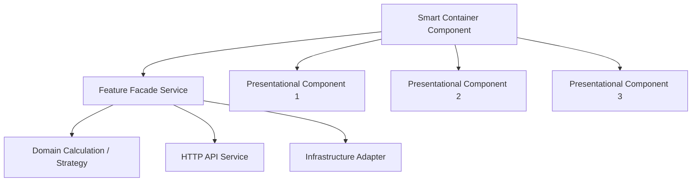

# ADR-0003: Reingeniería y Descomposición SRP de Componentes Dios

## Estado
Aceptado

## Fecha
2026-08-20

## Autores
- Equipo de Arquitectura Lealtix

## Contexto y Problema
El análisis del código fuente identificó varios "Archivos Dios" (*God Files*) con violaciones severas del principio de Responsabilidad Única (**SRP - Single Responsibility Principle**):
- `LealbotComponent`: **1,690 LOC** concentrando UI, DOM, carrito, cálculo de promociones, 5 flujos conversacionales y llamadas HTTP.
- `RegistroComponent`: **608 LOC** con formularios reactivos, validadores custom, ciclo de vida de Stripe SDK y gestión de pasos.
- `LandingPageHotelComponent`: **506 LOC** con carga de datos, scroll dinámico, navegación móvil, menús y formulario de captura.

Esto impedía el mantenimiento seguro, generaba alto riesgo de regresión ante cualquier cambio y violaba los estándares de calidad CMMI.

## Opciones Consideradas
1. **Mantener archivos monolíticos y refactorizar únicamente nombres**: No resuelve la deuda técnica ni la complejidad ciclomática.
2. **Descomposición superficial en archivos auxiliares tipo "helpers" estáticos**: Mantiene el acoplamiento pero fragmenta el código sin abstracción real.
3. **Reingeniería Integral bajo Patrón Smart & Presentational + Strategy + Facade**: Descomponer cada monolito en componentes especializados con una única razón para cambiar.

## Decisión
Se implementa una política obligatoria de **Descomposición SRP**:

### 1. Reglas Cuantitativas de Código
- **Longitud Máxima de Archivo**: $\le 250$ LOC para componentes y servicios.
- **Longitud Máxima de Método**: $\le 30$ LOC.
- **Complejidad Ciclomática**: $V(G) \le 10$ por función.
- **Separación de Responsabilidades**:
  - **Smart Component (Orquestador)**: Conecta Facade y distribuye datos hacia los hijos. No contiene manipulación directa de DOM ni llamadas HTTP ($< 100$ LOC).
  - **Presentational Component (Dumb)**: Recibe `@Input()`, emite `@Output()`, lógica visual pura y `ChangeDetectionStrategy.OnPush`.
  - **Domain Service / Facade**: Encapsula lógica de negocio y estado.
  - **Infrastructure Adapter**: Encapsula librerías de terceros (e.g. Stripe JS, Canvas Confetti).

## Consecuencias
- **Positivas**:
  - Componentes reutilizables, legibles y testeables de forma aislada.
  - Reducción dramática del riesgo de regresión.
  - Cumplimiento de estándares de calidad CMMI L4/L5.
- **Riesgo**: Incremento en el número total de archivos en el árbol del proyecto.
- **Mitigación**: Estructura de carpetas coherente por feature y barrel exports claros.
