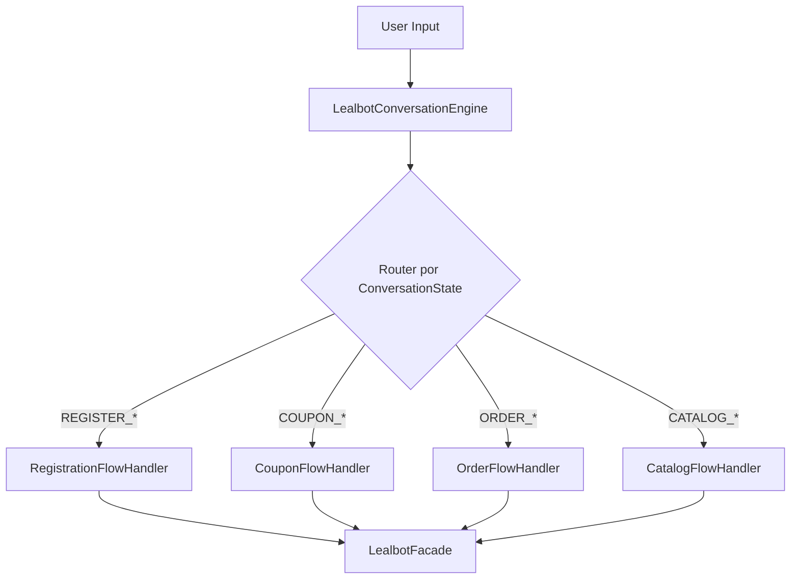

# ADR-0005: Motor Conversacional LealBot basado en Strategy Pattern & State Machine

## Estado
Aceptado

## Fecha
2026-08-20

## Autores
- Equipo de Arquitectura Lealtix

## Contexto y Problema
`LealbotComponent` (1,690 LOC) contenía un switch/if-else masivo para procesar las entradas del usuario a lo largo de 15 estados de conversación (`ConversationState.INITIAL`, `REGISTER_NAME`, `REGISTER_EMAIL`, `REGISTER_PHONE`, `COUPON_INPUT`, `ORDER_CONFIRMATION`, etc.). Cada nuevo paso o cambio en el flujo conversacional requería modificar el método gigante `handleUserInput()`, violando frontalmente el principio **Abierto/Cerrado (OCP - Open/Closed Principle)**.

Adicionalmente, la manipulación de arrays de mensajes, chips de respuesta rápida, carrito de compras y llamadas HTTP convivían en el mismo archivo.

## Opciones Consideradas
1. **Mantener el Switch monolítico en el componente**: Imposible de extender o mantener limpiamente; alta probabilidad de bugs colaterales.
2. **Motor con librerías externas de Bot (e.g. Botpress, Dialogflow)**: Introduce dependencias externas innecesarias para un bot conversacional embebido ligero y guiado por reglas.
3. **Patrón Strategy con Manejadores de Flujo Desacoplados**: Implementar una interfaz común `ILealbotStepHandler` donde cada flujo de conversación (Registro, Cupones, Carrito/Órdenes, Catálogo) es una clase especializada.

## Decisión
Se implementa el patrón **Strategy + State Pattern**:

1. **Interfaz de Estrategia**:
   ```typescript
   export interface ILealbotStepHandler {
     canHandle(state: ConversationState): boolean;
     handle(input: string, context: LealbotHandlerContext): Observable<LealbotStepResult>;
   }
   ```
2. **Estrategias Implementadas**:
   - `RegistrationFlowHandler`: Captura secuencial de Nombre, Email, Teléfono, Género y Fecha de Nacimiento.
   - `CouponFlowHandler`: Validación de código de cupón, cálculo de descuento y redención.
   - `OrderFlowHandler`: Envío de pedido al backend y confirmación.
   - `CatalogFlowHandler`: Navegación por categorías de productos y agregado al carrito.
3. **Orquestador de Estrategias (`LealbotConversationEngine`)**:
   - Resuelve el manejador adecuado según el estado actual de la conversación y delega el procesamiento.
4. **Subcomponentes de Presentación de LealBot**:
   - `LealbotHeaderComponent`
   - `LealbotMessagesListComponent`
   - `LealbotMessageBubbleComponent`
   - `LealbotQuickRepliesComponent`
   - `LealbotInputBarComponent`
   - `LealbotCartDrawerComponent`
   - `LealbotMenuCatalogComponent`



## Consecuencias
- **Positivas**:
  - Cumplimiento estricto de **OCP**: Nuevos flujos conversacionales se agregan creando un nuevo `Handler` sin tocar código existente.
  - Cada manejador es testeable unitariamente con mocks simples de contexto.
  - Reducción del componente visual `LealbotComponent` a $< 100$ LOC.
- **Riesgo**: Overhead menor por creación de múltiples clases manejadoras.
- **Mitigación**: Registro e inyección limpia de manejadores mediante un array de proveedores en Angular.
