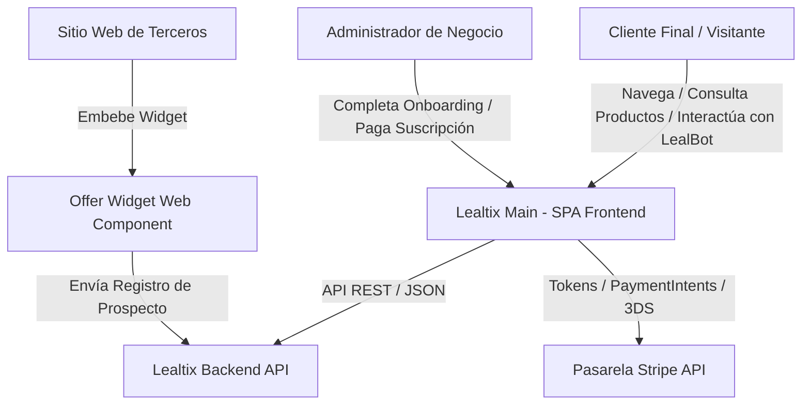
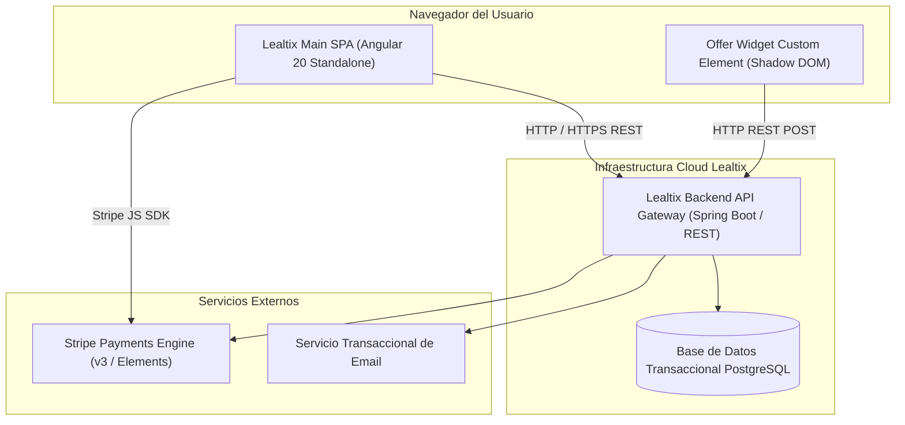

# SDD - Capítulo 2: Modelo C4 - Contexto (Nivel 1) y Contenedores (Nivel 2)

## 2.1 Modelo de Contexto del Sistema (C4 - Nivel 1)

El siguiente diagrama ilustra los actores clave y los sistemas externos con los cuales interactúa **Lealtix Main**:

### Descripción de Actores y Límites del Sistema:
- **Cliente Final**: Usuario que accede a la landing page de un tenant o de la plataforma para ver promociones, usar LealBot y registrarse como cliente leal.
- **Tenant Admin**: Dueño de negocio que recibe una invitación por correo y realiza el onboarding y suscripción a Lealtix.
- **Lealtix Backend API**: Servicio central (Spring Boot / NestJS) que gestiona autenticación, clientes, productos, tenants, suscripciones y pedidos.
- **Stripe API**: Pasarela de pagos para el procesamiento seguro de tarjetas de crédito y verificación 3D Secure.

---

## 2.2 Modelo de Contenedores (C4 - Nivel 2)

### Responsabilidades de los Contenedores Frontend:
1. **Lealtix Main SPA**: Aplicación de página única construida en Angular 20 con componentes *Standalone*, renderizado reactivo con Signals, y enrutamiento con *Lazy Loading*.
2. **Offer Widget Custom Element**: Elemento web empaquetado en formato IIFE autónomo (`dist/widget/widget.js`) con Shadow DOM para evitar colisiones de CSS en sitios web de clientes afiliados.
