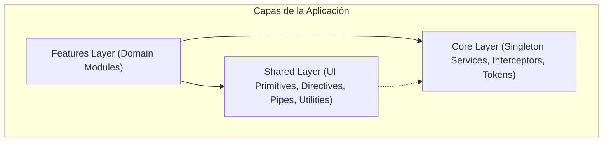
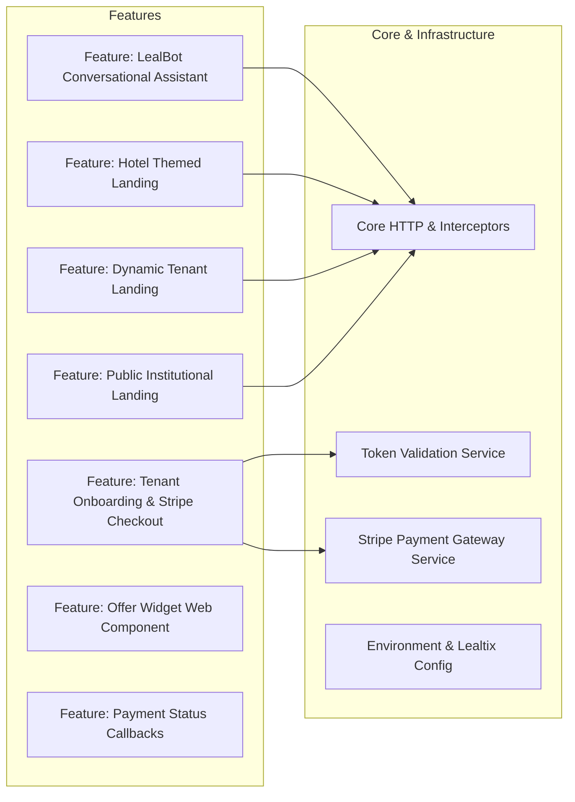

# SDD - Capítulo 3: Arquitectura de Componentes (C4 - Nivel 3)

## 3.1 Estructura Modular y Capas

La arquitectura interna de **Lealtix Main** se organiza en tres capas cardinales bajo los principios de **Clean Architecture** y **Domain-Driven Design**:

---

## 3.2 Desglose de Módulos de Feature

---

## 3.3 Catálogo de Componentes por Módulo

### 1. Módulo `features/lealbot`
- `LealbotComponent`: Smart Component orquestador ($< 100$ LOC).
- `LealbotHeaderComponent`: Cabecera con avatar e interactividad.
- `LealbotMessagesListComponent`: Lista reactiva de mensajes con gestión de scroll suave.
- `LealbotMessageBubbleComponent`: Renderizador polimórfico de mensajes (texto, botones, tarjetas).
- `LealbotQuickRepliesComponent`: Chips de sugerencia y respuestas automáticas.
- `LealbotInputBarComponent`: Barra de captura polimórfica (texto, teléfono, fechas, áreas).
- `LealbotCartDrawerComponent`: Visor deslizable de carrito con desglose de precios y cupones.
- `LealbotMenuCatalogComponent`: Visor de categorías y catálogo de productos.
- `LealbotFacade`: State management reactivo con Signals.
- `LealbotConversationEngine`: Router de estrategias conversacionales (`Strategy Pattern`).

### 2. Módulo `features/registro`
- `RegistroComponent`: Smart Component contenedor del Stepper ($< 90$ LOC).
- `RegistroStepperHeaderComponent`: Indicador gráfico de pasos de PrimeNG.
- `StepPersonalInfoComponent`: Formulario reactivo de datos personales del tenant.
- `StepPaymentStripeComponent`: Contenedor seguro para montaje de Stripe Elements.
- `StepConfirmationComponent`: Vista de bienvenida y confirmación exitosa con confeti.
- `RegistrationFacade`: Orquestador de validaciones de token y estado del onboarding.
- `StripePaymentGatewayService`: Adaptador del SDK de Stripe.

### 3. Módulo `features/landing-page-hotel`
- `LandingPageHotelComponent`: Smart Component orquestador ($< 80$ LOC).
- `HotelHeroNavbarComponent`: Navegación transparente y menú móvil.
- `HotelAboutSectionComponent`: Sección descriptiva de la historia y visión.
- `HotelMenuSectionComponent`: Menú categorizado con filtros interactivos.
- `HotelPromotionsCarouselComponent`: Carrusel de promociones activas.
- `HotelCaptureFormComponent`: Formulario de captura de clientes leales.
- `HotelFooterComponent`: Pie de página y enlaces legales.
- `HotelLandingFacade`: Facade de estado y carga por slug.
