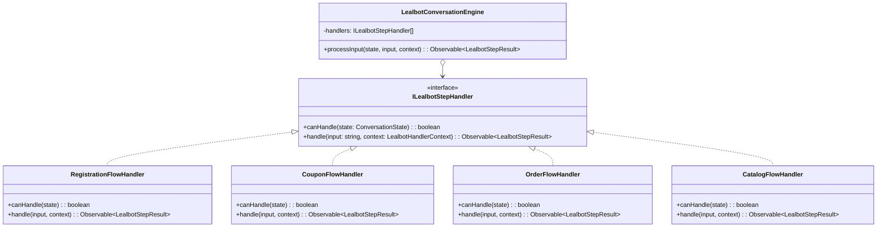
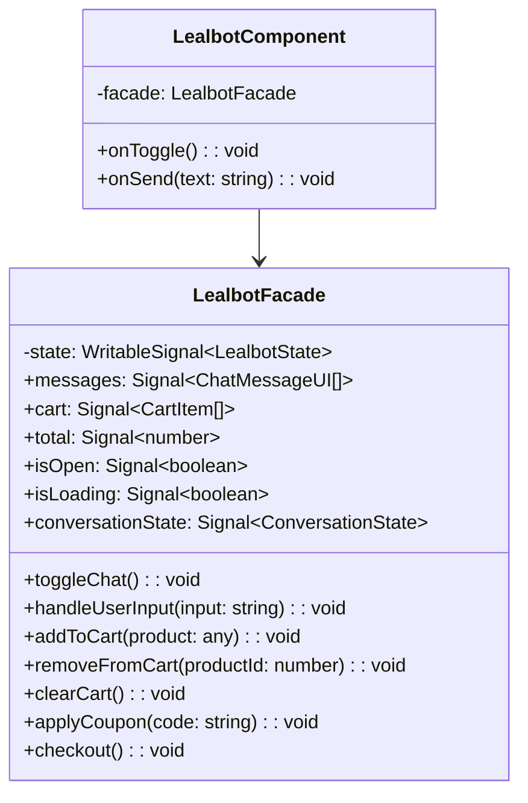
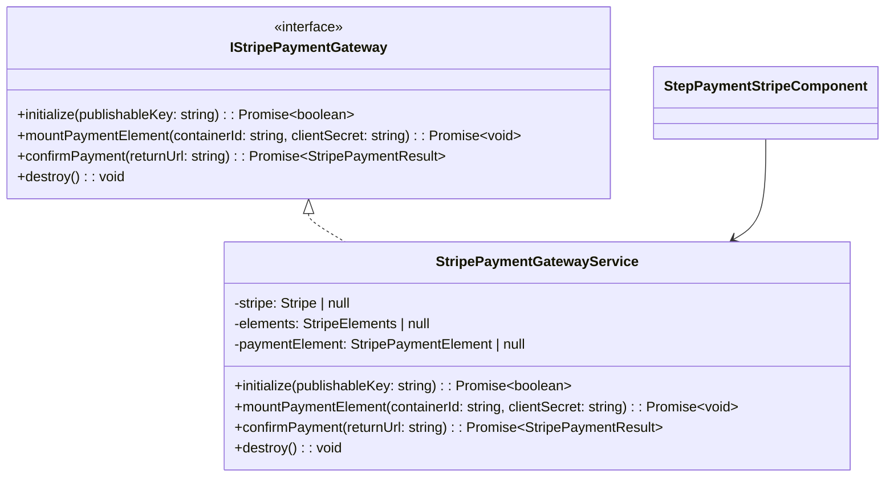

# SDD - Capítulo 4: Diseño de Código y Patrones de Diseño (C4 - Nivel 4)

## 4.1 Patrones de Diseño Implementados

---

## 4.2 Patrón Facade para Manejo de Estado

---

## 4.3 Adaptador de Pasarela de Pagos Stripe

---

## 4.4 Cumplimiento de Principios SOLID

1. **Single Responsibility Principle (SRP)**:
   - Los componentes de vista solo renderizan datos recibidos y emiten intenciones del usuario.
   - Las llamadas a APIs residen en servicios HTTP específicos.
   - La gestión del estado reside en Facades con Signals.
2. **Open/Closed Principle (OCP)**:
   - El motor conversacional de LealBot permite registrar nuevos flujos implementando `ILealbotStepHandler` sin alterar el engine central.
3. **Liskov Substitution Principle (LSP)**:
   - Todas las estrategias conversacionales pueden ser sustituidas indistintamente por el motor de diálogo.
4. **Interface Segregation Principle (ISP)**:
   - Interfaces pequeñas y específicas para cada paso del formulario y del bot (`DialogChip`, `CustomerValidation`, `CartCalculations`).
5. **Dependency Inversion Principle (DIP)**:
   - Componentes dependen de abstracciones y Facades inyectables (`providedIn: 'root'` o a nivel de módulo con InjectionTokens).
