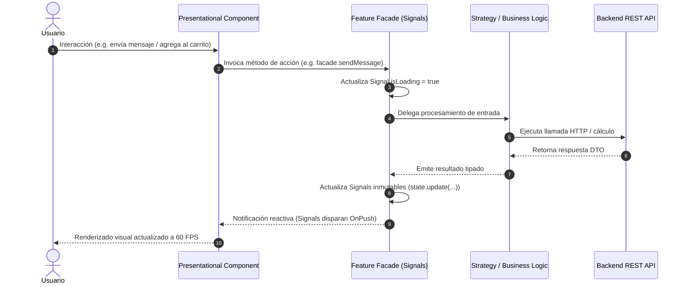

# SDD - Capítulo 5: Gestión de Estado y Flujos de Datos

## 5.1 Flujo Unidireccional de Datos (UDF)

La aplicación sigue el paradigma de flujo de datos unidireccional (*Unidirectional Data Flow*) mediado por **Angular Signals** y servicios Facade:



---

## 5.2 Estructura del Estado Inmutable de LealBot

```typescript
export interface LealbotState {
  readonly sessionId: string;
  readonly customer: Customer | null;
  readonly messages: readonly ChatMessageUI[];
  readonly cart: readonly CartItem[];
  readonly isLoading: boolean;
  readonly error: string | null;
  readonly appliedCoupon: CouponValidationData | null;
  readonly redeemedCoupon: Coupon | null;
  readonly subtotal: number;
  readonly discount: number;
  readonly total: number;
  readonly isOpen: boolean;
  readonly availableCoupons: readonly Coupon[];
  readonly conversationState: ConversationState;
  readonly currentQuickReplies: readonly DialogChip[];
  readonly currentInputType: 'TEXT' | 'EMAIL' | 'PHONE' | 'TEXTAREA' | 'CONTACT' | 'DATE' | null;
  readonly inputPlaceholder: string;
}
```

---

## 5.3 Ciclo de Vida y Limpieza Reactiva

Para prevenir fugas de memoria (*memory leaks*):
- Todo Facade o componente que consuma observables directos implementa `takeUntilDestroyed()` de `@angular/core/rxjs-interop` o destruye explícitamente sus suscripciones en `ngOnDestroy()`.
- Los bindings de vista consumen directamente `signals` invocados por función `facade.messages()` sin necesidad de `async pipe` ni suscripciones manuales.
