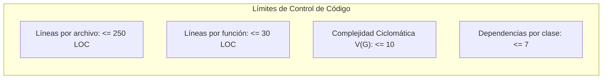

# SDD - Capítulo 7: Métricas Cuantitativas y Aseguramiento de Calidad (CMMI L4/L5)

## 7.1 Métricas Estadísticas y Límites de Control (CMMI Nivel 4)

El desarrollo en **Lealtix Main** se rige por límites de control cuantitativo (*Control Limits*) para prevenir la degradación de la arquitectura:

### Tabla de Umbrales de Calidad

| Métrica de Código | Valor Óptimo | Límite Superior de Alerta | Límite Crítico (Rechazo de PR) |
|---|---|---|---|
| **Líneas por Archivo (LOC)** | $< 150$ | $200$ | $> 250$ |
| **Líneas por Método / Función** | $< 20$ | $25$ | $> 30$ |
| **Complejidad Ciclomática $V(G)$** | $\le 5$ | $8$ | $> 10$ |
| **Acoplamiento Eferente ($Ce$)** | $\le 4$ | $6$ | $> 7$ |
| **Profundidad de Herencia (DIT)** | $1$ | $2$ | $> 2$ |
| **Tiempo de Compilación (`ng build`)** | $< 30\text{ s}$ | $45\text{ s}$ | $> 60\text{ s}$ |

---

## 7.2 Proceso de Optimización Continua (CMMI Nivel 5)

Para asegurar la mejora continua y la causa raíz de posibles defectos:

1. **Auditoría de Inmutabilidad**: Revisión de que todos los estados se modifiquen mediante copias inmutables (`{ ...state, prop: val }`) y Signals.
2. **Análisis de Bundle Size**:
   - Bundle inicial: $\le 2\text{ MB}$ (Warning) / $3\text{ MB}$ (Error).
   - Estilos de componente: $\le 20\text{ kB}$ (Warning) / $25\text{ kB}$ (Error).
   - Widget bundle (`widget.js`): $\le 150\text{ kB}$.
3. **Manejo de Errores Tipado**: Prohibición de bloques `catch (e: any)` sin tipado o estructuración de errores para observabilidad.
4. **Política de Cero Regresión**: Verificación estricta de compilación limpia de la aplicación y del empaquetado del widget tras cada ciclo de refactorización.
